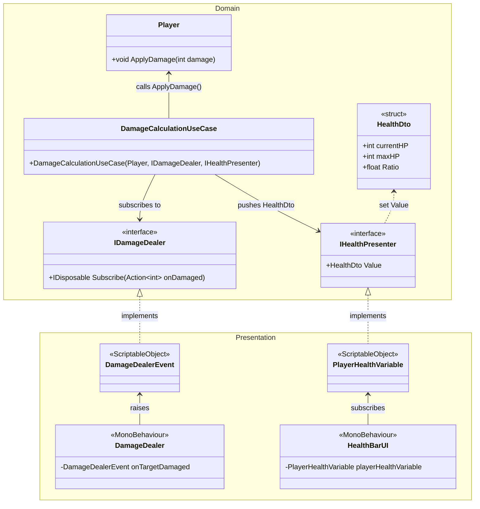

# Aiming Techbook — Sample Project

A Unity 2D sample project accompanying the Aiming Techbook series, demonstrating a clean architecture approach that strictly separates pure C# domain logic from Unity/SOAR presentation concerns.

## Architecture Overview

The codebase is split into two layers:

- **`01_Domain`** — Pure C# with zero Unity dependencies. Contains entities (`Player`, `PlayerData`), domain interfaces (`IDamageDealer`, `IHealthPresenter`), and the use case (`DamageCalculationUseCase`) that orchestrates damage logic.
- **`02_Presentation`** — Unity-facing layer that implements domain interfaces via SOAR `ScriptableObject`-based events and variables (`DamageDealerEvent`, `PlayerHealthVariable`), and drives visuals through MonoBehaviour components.

Runtime wiring between the two layers is handled by **Doinject**, registered in `GameInstaller`.

## Key Libraries

| Library | Role |
|---|---|
| [SOAR](https://github.com/ripandy/SOAR) | ScriptableObject-based event and variable system |
| [Doinject](https://github.com/mewlist/Doinject) | Dependency injection container |
| [R3](https://github.com/Cysharp/R3) | Reactive extensions (`Observable`) |
| [UniTask](https://github.com/Cysharp/UniTask) | Async/await for Unity |
| [LitMotion](https://github.com/AnnulusGames/LitMotion) | High-performance tween animations |

## Class Diagram

